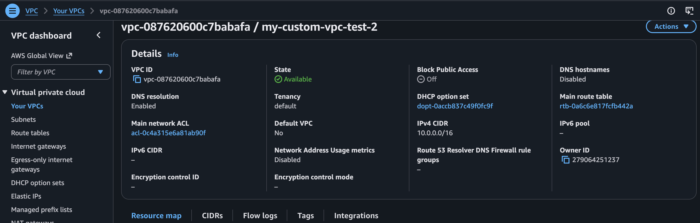
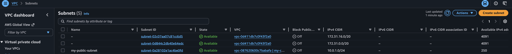
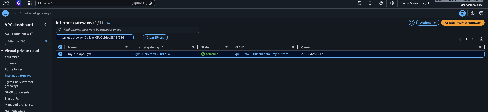
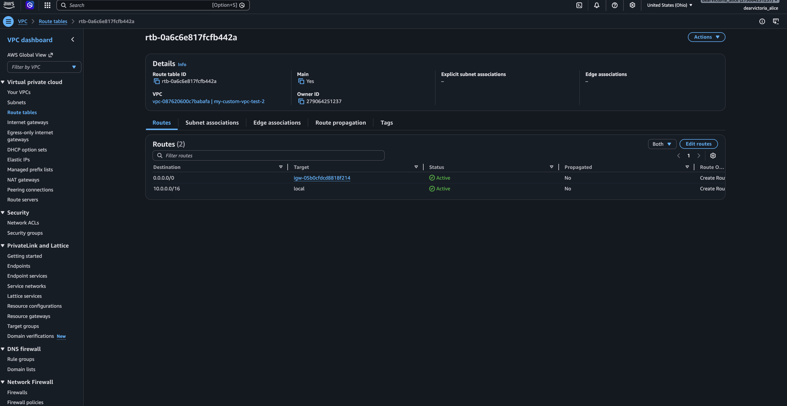
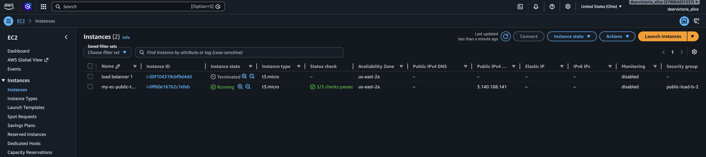
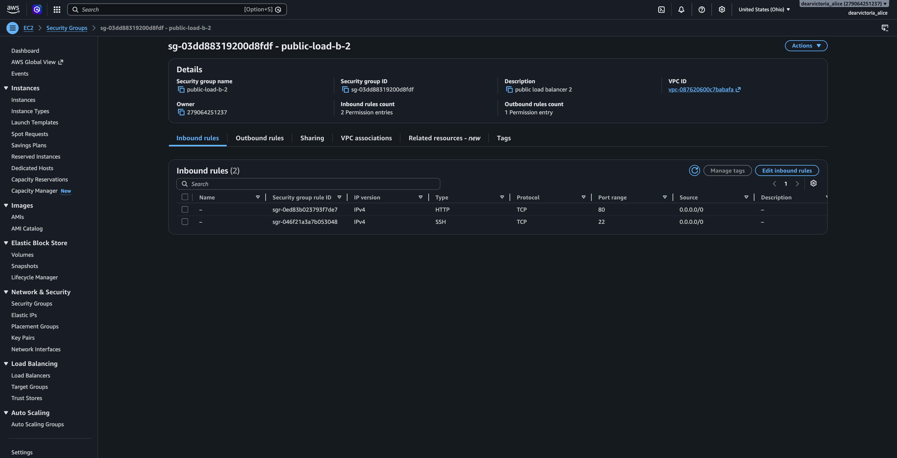
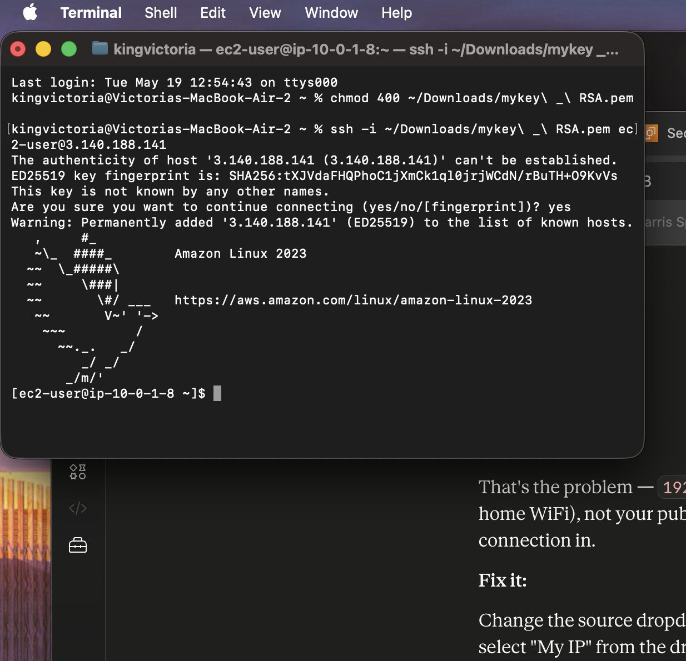

AWS - VPC - PROJECT README
# AWS VPC Build — Cloud Infrastructure Project

A custom AWS Virtual Private Cloud (VPC) built from scratch demonstrating core cloud networking fundamentals. This project forms the infrastructure foundation for the F1 Pit Lane Dashboard (Project 2).

---

## What I Built

A fully functional cloud network environment on AWS consisting of:

- Custom VPC with a defined private IP space
- Public subnet carved from the VPC CIDR block
- EC2 virtual machine instance running Amazon Linux 2023
- Internet Gateway enabling outbound internet connectivity
- Route table configured to direct traffic through the IGW
- Security group restricting SSH access to my IP only

---

## Architecture
Internet
│
Internet Gateway (my-igw)
│
VPC: 10.0.0.0/16
│
Public Subnet: 10.0.1.0/24
│
EC2 Instance (t3.micro) ← Security Group (port 22, my IP only)
---

## Screenshots

### Custom VPC

### Public Subnet

### Internet Gateway Attached

### Route Table

### EC2 Instance Running

### Security Group Rules

### SSH Connection Confirmed

---

## Key Concepts Demonstrated

**CIDR notation** — the VPC owns `10.0.0.0/16` (65,536 addresses). The subnet is a `/24` slice (256 addresses) carved from that range. Subnets must be non-overlapping subdivisions of the parent VPC CIDR.

**Internet Gateway** — without the IGW the VPC is completely isolated. Creating it is not enough — it must be attached to the VPC and referenced in the route table before traffic can flow.

**Route table** — the rule `0.0.0.0/0 → igw` tells AWS to send all outbound traffic through the internet gateway. Without this rule the IGW exists but traffic has no path to use it.

**Security groups** — stateful firewalls at the instance level. Port 22 (SSH) restricted to my public IP only — not `0.0.0.0/0`. This is least privilege applied at the network level.

**Key pair authentication** — SSH uses asymmetric cryptography. AWS stores the public key on the EC2 instance. I keep the private key (.pem file) locally. The `chmod 400` command restricts the key file permissions so only the owner can read it — SSH refuses to connect with loose permissions as a security measure.

---

## Mistakes Made and Fixed

**Wrong CIDR range** — initially typed `10.0.1.0/24` as the subnet when my VPC was `172.31.0.0/16`. These are different IP families — the subnet must be a slice of the parent VPC range.

**Subnet overlap** — hit an overlap error because AWS default subnets already occupied part of the range. Fixed by checking existing subnets and picking a non-overlapping block.

**Default VPC conflict** — originally launched the EC2 into the AWS default VPC instead of my custom one. The default VPC already had an IGW attached so I couldn't attach a second one. Fixed by terminating everything and rebuilding with a custom VPC from scratch.

**Security group open to 0.0.0.0/0** — initial setup had SSH open to the entire internet. Fixed by changing the source to My IP only.

**Local IP vs public IP** — entered `192.168.1.7` (local network IP) instead of my public IP into the security group. AWS needs the public IP — fixed by using the My IP dropdown which auto-detects it.

---

## Infrastructure Details

| Component | Value |
|---|---|
| VPC CIDR | `10.0.0.0/16` |
| Subnet CIDR | `10.0.1.0/24` |
| Availability Zone | us-east-2a |
| Instance type | t3.micro |
| AMI | Amazon Linux 2023 |
| SSH port | 22 |
| SSH source | My IP only |

---

## Relation to Project 2

This VPC serves as the deployment infrastructure for the [F1 Pit Lane Dashboard](https://github.com/victoriaalicex/f1-pitlane-dashboard). The EC2 instance hosts the Node.js application, demonstrating end-to-end ownership from network architecture to application deployment.
---

## Screenshots

### Custom VPC

### Public Subnet

### Internet Gateway Attached

### Route Table

### EC2 Instance Running

### Security Group Rules

### SSH Connection Confirmed

---

## Key Concepts Demonstrated

**CIDR notation** — the VPC owns `10.0.0.0/16` (65,536 addresses). The subnet is a `/24` slice (256 addresses) carved from that range. Subnets must be non-overlapping subdivisions of the parent VPC CIDR.

**Internet Gateway** — without the IGW the VPC is completely isolated. Creating it is not enough — it must be attached to the VPC and referenced in the route table before traffic can flow.

**Route table** — the rule `0.0.0.0/0 → igw` tells AWS to send all outbound traffic through the internet gateway. Without this rule the IGW exists but traffic has no path to use it.

**Security groups** — stateful firewalls at the instance level. Port 22 (SSH) restricted to my public IP only — not `0.0.0.0/0`. This is least privilege applied at the network level.

**Key pair authentication** — SSH uses asymmetric cryptography. AWS stores the public key on the EC2 instance. I keep the private key (.pem file) locally. The `chmod 400` command restricts the key file permissions so only the owner can read it — SSH refuses to connect with loose permissions as a security measure.

---

## Mistakes Made and Fixed

**Wrong CIDR range** — initially typed `10.0.1.0/24` as the subnet when my VPC was `172.31.0.0/16`. These are different IP families — the subnet must be a slice of the parent VPC range.

**Subnet overlap** — hit an overlap error because AWS default subnets already occupied part of the range. Fixed by checking existing subnets and picking a non-overlapping block.

**Default VPC conflict** — originally launched the EC2 into the AWS default VPC instead of my custom one. The default VPC already had an IGW attached so I couldn't attach a second one. Fixed by terminating everything and rebuilding with a custom VPC from scratch.

**Security group open to 0.0.0.0/0** — initial setup had SSH open to the entire internet. Fixed by changing the source to My IP only.

**Local IP vs public IP** — entered `192.168.1.7` (local network IP) instead of my public IP into the security group. AWS needs the public IP — fixed by using the My IP dropdown which auto-detects it.

---

## Infrastructure Details

| Component | Value |
|---|---|
| VPC CIDR | `10.0.0.0/16` |
| Subnet CIDR | `10.0.1.0/24` |
| Availability Zone | us-east-2a |
| Instance type | t3.micro |
| AMI | Amazon Linux 2023 |
| SSH port | 22 |
| SSH source | My IP only |

---

## Relation to Project 2

This VPC serves as the deployment infrastructure for the [F1 Pit Lane Dashboard](https://github.com/victoriaalicex/f1-pitlane-dashboard). The EC2 instance hosts the Node.js application, demonstrating end-to-end ownership from network architecture to application deployment.
